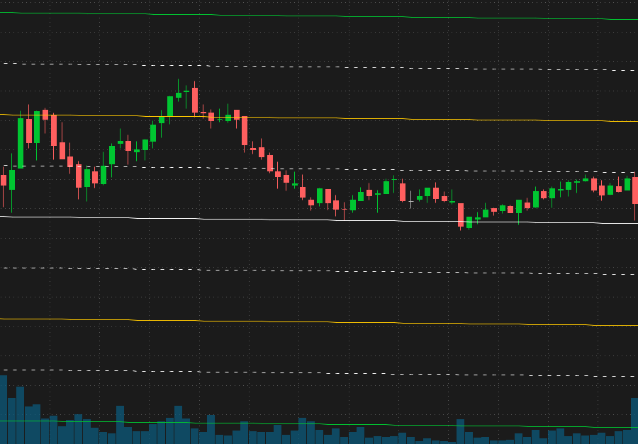

# Thinkify
Thinkify is a collection of studies for TD Ameritrade's <em>thinkorswim</em> platform. The studies can be used to apply technical analysis in order to analyze the price of securities. 

## Setup and Installation
On the <em>thinkorswim</em> platform,  
1) Click 'Edit studies' on right side of the ticker bar.  
2) Click 'import', and then select the study file you want to add.  
3) Add the study to the chart by searching for it in the 'Studies' menu.

## Studies

### 1) Volume Pressure
The volume pressure study dissects the original volume study and differentiates the buying volume from the selling volume. This can be used to determine the strength of a trend and also signify an end of a trend or potential reversals.

Below is the volume pressure study as it displays on <em>thinkorswim</em>.

### 1) Chained Standard Deviation
The chained standard deviation study consists of two standard deviation channels which show the general buying and selling zones of a stock. Within the two main channels, dotted lines show the half standard deviation. Both the half and full standard deviation lines frequently tend to act as support/resistance. This study can be used with multiple time frames for additional confirmation of a trade entry.

Below is the chained standard deviation study as it displays on <em>thinkorswim</em>.
